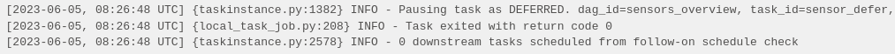
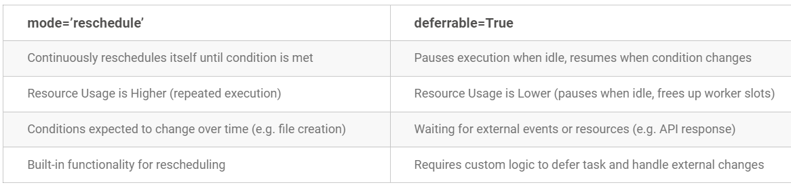

# Deferrable operators
- The rerun mode manages to free resources by marking the task as up_for_reschedule and rescheduling it for the next interval. However, it has its limits:

- The intervals are fixed (or exponentially fixed). In some cases, it would be convenient.
This mode is unique to the sensors. It would be ideal if it were a generalizable process for those long tasks that wait for some condition external to Airflow.

- With these two points in mind, Airflow decides to go a step further and offers deferrable operators, which can be applied to any operator

- With Airflow 2.2 and later, you can use deferrable operators to run tasks in your Airflow environment
- These operators leverage the Python asyncio library to efficiently run tasks waiting for an external resource to finish
- This frees up your workers and allows you to utilize resources more effectively.

- When an operator is deferrable, it is marked in purple in the UI and a trigger is created, which consists of a small asynchronous Python code that waits for a condition to be met. Triggers are associated with a callback, which is defined through a method in the operator

- Use deferrable operators instead of Smart Sensors, which were removed in Airflow 2.4.0.

- To use deferrable operators, you must have a triggerer running in your Airflow environment

- Many Airflow operators, can be set to run in deferrable mode using the deferrable parameter.

- If the operator you want to use does not have a deferrable parameter, you can look for a separate deferrable version of the operator in the Astronomer Registry. These operators usually have the same name as the original operator, but with the word Async appended to the end. For example, the TimeSensorAsync is the deferrable version of the TimeSensor.


- In the following example, a task is created this time using TimeDeltaSensorAsync, which is set up to be deferrable:
```
sensor_defer = TimeDeltaSensorAsync(
    task_id='sensor_defer',
    dag=dag,
    delta=timedelta(min-utes=1)
)
```

- It can be seen that, in this case, the task is marked as DEFERRED until the condition (timedelta) is met:




- If the triggerer is not configured, this task will remain in this state until the timeout time is reached.


## Deferrable Operators
- Deferrable Operators suspend themselves and free up the worker slot
- They hand off the job of checking and taking action to a Trigger. 
- Once the operators defer themselves they enter into a new state called DEFERRED. 
- During this state, the operator will be stopped and removed from its worker slot. 
- Once Trigger finds its successful condition check it will resume Operator at a certain method defined by the Operator.

## The Trigger
- A trigger is a small piece of asynchronous python code that quickly and continuously evaluate a condition
- Due to their small footprint, thousands of such small tasks can run in a single-parent process
- This single-parent process is called the Triggerer service.

## The Triggerer Service
- Triggerer service, similar to the scheduler service, runs an event loop
- The difference here is that this is an aysncio event loop
- This process runs trigger and signals tasks to resume when the condition is met.

- The new flow for a deferrable operator is as below.

```
Running → Deferred → Triggerer → Queued
```


## Difference between Mode=’reschedule’ and Deferrable=True in Sensors



