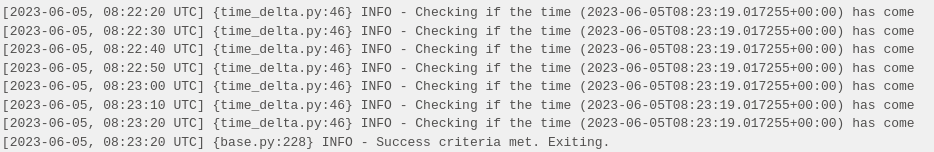
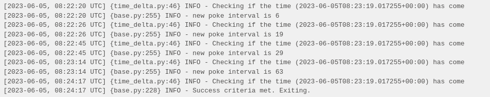
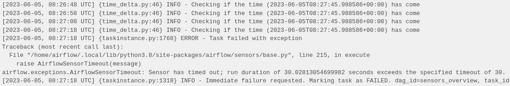
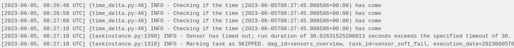
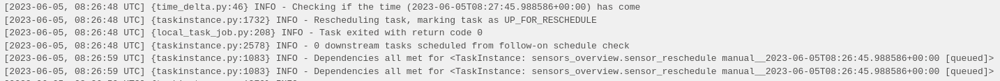

# Airflow sensors
- Apache Airflow sensors are a special kind of operator that are designed to wait for something to happen. 
- When sensors run, they check to see if a certain condition is met before they are marked successful and let their downstream tasks execute.
- When used properly, they can be a great tool for making your DAGs more event driven.

## Sensor basics
- Sensors are a type of operator that checks if a condition is met at a specific interval.
- If the condition is met, the task is marked successful and the DAG can move to downstream tasks. 
- If the condition isn't met, the sensor waits for another interval before checking again.

### mode: How the sensor operates. There are two types of modes:
- poke: This is the default mode. When using poke, the sensor occupies a worker slot for the entire execution time and sleeps between pokes. This mode is best if you expect a short runtime for the sensor.
- reschedule: When using this mode, if the criteria is not met then the sensor releases its worker slot and reschedules the next check for a later time. This mode is best if you expect a long runtime for the sensor, because it is less resource intensive and frees up workers for other tasks.

### poke_interval: When using poke mode, this is the time in seconds that the sensor waits before checking the condition again. The default is 60 seconds.
### exponential_backoff: When set to True, this setting creates exponentially longer wait times between pokes in poke mode.
### timeout: The maximum amount of time in seconds that the sensor checks the condition. If the condition is not met within the specified period, the task fails.
### soft_fail: If set to True, the task is marked as skipped if the condition is not met by the timeout.

## Commonly used sensors
- Many Airflow provider packages contain sensors that wait for various criteria in different source systems. The following are some of the most commonly used sensors:

### @task.sensor decorator: Allows you to turn any Python function that returns a PokeReturnValue into an instance of the BaseSensorOperator class. This way of creating a sensor is useful when checking for complex logic or if you are connecting to a tool via an API that has no specific sensor available.
### S3KeySensor: Waits for a key (file) to appear in an Amazon S3 bucket. This sensor is useful if you want your DAG to process files from Amazon S3 as they arrive.
### DateTimeSensor: Waits for a specified date and time. This sensor is useful if you want different tasks within the same DAG to run at different times.
### ExternalTaskSensor: Waits for an Airflow task to be completed. This sensor is useful if you want to implement cross-DAG dependencies in the same Airflow environment.
### HttpSensor: Waits for an API to be available. This sensor is useful if you want to ensure your API requests are successful.
### SqlSensor: Waits for data to be present in a SQL table. This sensor is useful if you want your DAG to process data as it arrives in your database.


## Sensor best practices
- When using sensors, keep the following in mind to avoid potential performance issues:

   - Always define a meaningful timeout parameter for your sensor. The default for this parameter is seven days, which is a long time for your sensor to be running. When you implement a sensor, consider your use case and how long you expect the sensor to wait and then define the sensor's timeout accurately.
   - Whenever possible and especially for long-running sensors, use the reschedule mode so your sensor is not constantly occupying a worker slot. This helps avoid deadlocks in Airflow where sensors take all of the available worker slots.
   - If your poke_interval is very short (less than about 5 minutes), use the poke mode. Using reschedule mode in this case can overload your scheduler.
   - Define a meaningful poke_interval based on your use case. There is no need for a task to check a condition every 60 seconds (the default) if you know the total amount of wait time will be 30 minutes.


## How Apache Airflow sensors work
- A while loop is in charge of reevaluating the sensor condition until it is successful (or an exception is raised).

- When the condition of the poke method is not met and no exception is raised, the sensor waits for a sleep time before continuing with the next iteration of the loop. The poke_interval parameter allows to adjust this time while the exponential_backoff parameter makes this time increase exponentially (this can be useful to avoid overloading a service). 

- In this example, you can see the log of the following task sensor_time_delta, if a manual execution of the DAG is performed:

```
from datetime import datetime, timedelta

from airflow import DAG
from airflow.sensors.time_delta import TimeDeltaSensor, TimeDeltaSensorAsync


DEFAULT_DAG_ARGS = {
    'start_date': datetime(2023, 6, 4),
}

dag = DAG(
    'sensors_overview',
    default_args=DEFAULT_DAG_ARGS,
    schedule_interval=None
)

sensor_time_delta = TimeDeltaSensor(
   task_id='sensor_time_delta',
   dag=dag,
   delta=timedelta(minutes=1),
   poke_interval=10,  # seconds
)
```



## If we apply exponential_backoff=True to this same sensor, the log is as follows:




- On the other hand, the timeout parameter allows to break the loop in case a time limit is exceeded and to mark the task as failed (or skipped, in case of using the soft_fail parameter).

- In the following example, we set the timeout parameter to 30 seconds. This task always fails because the success condition of the sensor is a time greater than this timeout.

```
sensor_fail = TimeDeltaSensor(
    task_id='sensor_fail',
    dag=dag,
    delta=timedelta(minutes=1),
    poke_interval=10,  # seconds
    timeout=30,  # seconds
)
```

- The result is as follows, with the task marked FAILED:


- If we apply soft_fail=True to this same sensor, we obtain the following result, with the task marked as SKIPPED:



## Modes
- Sensors in Airflow allow another parameter: mode. This parameter allows to switch from default mode (poke) to reschedule mode (reschedule)
- In this new mode, when the sensor condition is not met, the AirflowRescheduleException is thrown which breaks the loop and causes the task to be marked as up_for_reschedule status (in cyan color)
- The task is sent to the Airflow scheduler to be rescheduled for the next poke_interval. In this way, the worker is freed from the period between the intervals so that it can devote its resources to other work.

- In the following example, the previous sensor mode is set to reschedule:
```
sensor_reschedule = TimeDeltaSensor(
    task_id='sensor_reschedule',
    dag=dag,
    delta=timedelta(minutes=1),
    poke_interval=10,  # seconds
    mode='reschedule',  # seconds
)
```


- In the Airflow UI, you can see that the task is marked as UP_FOR_RESCHEDULE status in the waiting intervals. In the log, you can see how after 10 seconds (poke interval), the task starts running again (it is queued).




- The rerun mode is useful for sensors that may take a long time to fulfill the condition. It is also of interest to use this mode if you intend to use many sensors at once. However, it should not be used for sensors with very short poke_interval, as this could overload the Airflow scheduler. The documentation recommends intervals longer than 1 minute.
