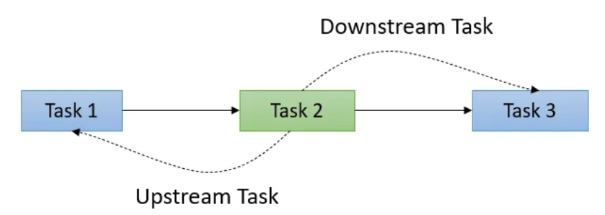
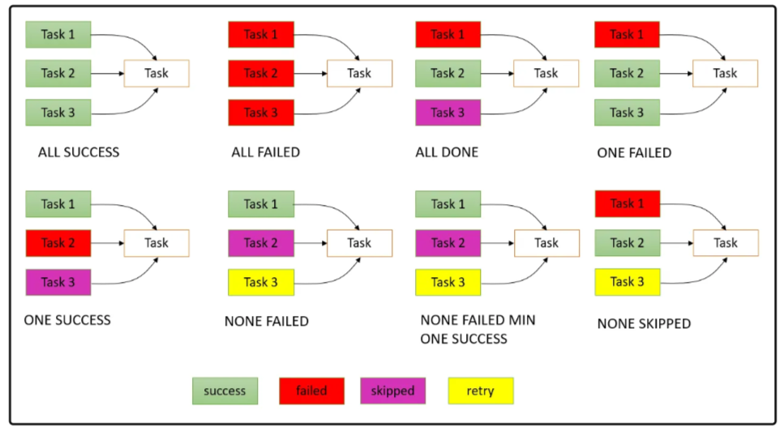

# Creating task dependencies between DagRuns

## Task Dependencies
- We can set dependency between tasks or to be more precise pipeline flow, using the following two methods.

  - set_downstream
  - set_upstream

- We can also set dependency between tasks in the current run and the previous run of the DAG.

  - depends_on_past — If set to true, the task in the current DAG run will only run if the same task succeeded or was skipped in the previous run.
  - wait_for_downstream — If set to true, the task in the current run will only run if the same task succeeded or skipped in the previous run and the immediate downstream task in the previous run also succeeded or was skipped.

### Trigger Rules

- all_success (default): Dependent task will execute if all upstream tasks have succeeded, failed, or skipped task will cause the dependent task to be skipped. All upstream task == all successful up stream task.
- all_failed: Dependent task runs when all upstream tasks are in a failed or upstream_failed state.
- all_done: Dependent task runs when all upstream tasks are done with their execution, success, failure, or skipped does not matter. Their execution must have been completed. In this case all upstream task ≤ count of succeeded, failed, upstream_failed, skipped tasks.
- one_failed: Dependent task runs when at least one upstream task has failed (does not wait for all upstream tasks to be done).
- one_success: Dependent task run when at least one upstream task has succeeded (does not wait for all upstream tasks to be done).
- none_failed: Dependent task runs only when all upstream tasks have not failed or upstream_failed - that is, all upstream tasks have succeeded or been skipped .
- none_failed_min_one_success: Dependent task runs only when all upstream tasks have not failed or upstream_failed, and at least one upstream task has succeeded.
- none_skipped: Dependent task runs only when no upstream task is in a skipped state - that is, all upstream tasks are in a success, failed, or upstream_failed state.
- always: Dependent tasks will run at any time.

