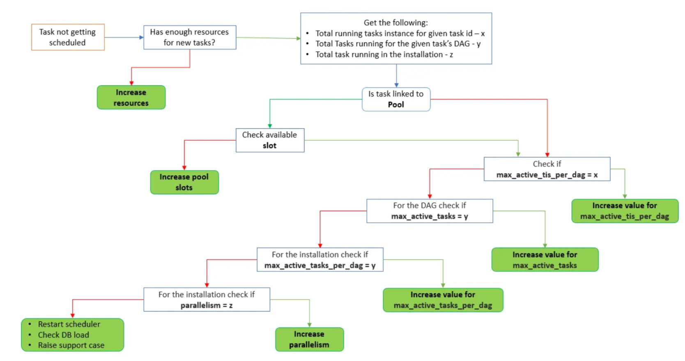

# Airflow Task Parallelism
- Airflow allows us to run multiple tasks in parallel
- At the same time, Airflow is highly configurable hence it exposes various configuration parameters to control the amount of parallelism
- There are many configuration options that control the number of tasks that can run in parallel.

- There are three broad categories into which the configurations can be clubbed —
   - Installation level
   - DAG level
   - Task level

## Installation level

### Parallelism
This defines the maximum number of task instances that can run simultaneously per scheduler in Airflow
- Since this configuration is per scheduler, having two schedulers will double the maximum count of concurrently running tasks provided other configurations allow

### MAX_ACTIVE_TASKS_PER_DAG
This defines the maximum number of task instances in the RUNNING, QUEUED state for all active runs of a DAG. The default value is 16.

### DEFAULT_POOLED_TASK_SLOT_COUNT
This parameter defines the total slots available to the pool. Lowering this value results in lower parallelism as the number of tasks that run is low. The default value is 128.

### MAX_ACTIVE_RUNS_PER_DAG
This defines the maximum number of active DAG runs for a DAG. The scheduler will not create any more DAG runs if this limit is reached. The default value is 16.

### Multiple schedulers
With Airflow 2.0+ multiple schedulers can be run within Airflow. We can increase the concurrency of the task by increasing the number of schedulers. This will increase the task concurrency set at the scheduler level.



## DAG level
## max_active_tasks
- This defines the maximum number of task instances allowed to run across all active DAG run for the specific DAG. - 
- If not set it will fallback to MAX_ACTIVE_TASK_PER_DAG.

## max_active_runs
- This defines the maximum number of active runs of the given DAG
- If not set explicitly it defaults to max_active_runs_per_dag.

```
d = DAG('my_cool_dag', max_active_tasks=10, max_active_runs=2)
```

## Task level
## Pool
- This defines in which pool the task will get executed
- Pools can be used to limit parallelism for a logical set of some tasks. 
- Each task will take up a defined number of slots from the pool slots and when it consumed slot count reaches the maximum slot's value, no more tasks will get queued.

- The default number of slots for a pool is 128.

## max_active_tis_per_dag
- This defines the maximum number of active task instances of this task across all active DAG runs

```
t1 = Operator('task_id', pool='critical', max_active_tis_per_dag=3)
```
