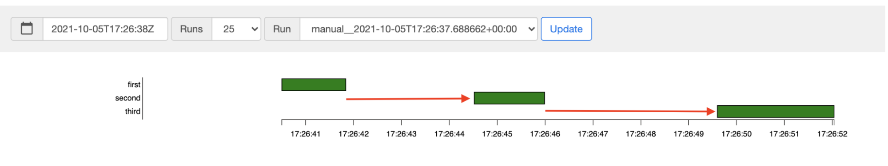

# Optimize environment performance and costs
- Recommend to start with one of the presets, based on the following estimates:
  - Total number of DAGs that you plan to deploy in the environment
  - Maximum number of concurrent DAG runs
  - Maximum number of concurrent tasks  

- Your environment's performance depends on the implementation of specific DAGs that you run in your environment. 
- The following table lists estimates that are based on the average resource consumption. 
- If you expect your DAGs to consume more resources, adjust the estimates accordingly.

## Observe your environment's performance

### Go to the Monitoring dashboard
- In the Google Cloud console, go to the Environments page.
- Go to Environments
- Click the name of your environment.
- Go to the Monitoring tab.

### Monitor scheduler CPU and memory metrics
- Airflow scheduler's CPU and memory metrics help you check whether the scheduler's performance is a bottleneck in the overall Airflow performance.

- On the Monitoring dashboard, in the Schedulers section, observe graphs for the Airflow schedulers of your environment:
   - Total schedulers CPU usage
   - Total schedulers memory usage

- If the Scheduler CPU usage is consistently below 30%-35%:
  - Reduce the number of schedulers
  - Reduce the CPU of schedulers

- If Scheduler CPU usage exceeds 80% for longer than a few percent of the total time:
   - Increase the DAG file parsing interval and increase the DAG directory listing interval
   - Increase the number of schedulers
   - Increase the CPU of schedulers

### Monitor the total parse time for all DAG files
- The schedulers parse DAGs before scheduling DAG runs. If DAGs take a long time to parse, this consumes scheduler's capacity and might reduce the performance of DAG runs.

- In the Monitoring dashboard, in the DAG Statistics section, observe graphs for the total DAG parse time.

- If the number exceeds about 10 seconds, your schedulers might be overloaded with DAG parsing and cannot run DAGs effectively. The default DAG parsing frequency in Airflow is 30 seconds; if DAG parsing time exceeds this threshold, parsing cycles start to overlap, which then exhausts scheduler's capacity.

- According to your observations:

   - Simplify your DAGs, including their Python dependencies.
   - Increase the DAG file parsing interval and increase the DAG directory listing interval.
Increase the number of schedulers.
   - Increase the CPU of schedulers.

### Monitor worker pod evictions
- Pod eviction can happen when a particular pod in your environment's cluster reaches its resource limits.

- The majority of issues with worker pod evictions happen because of out-of-memory situations in workers.

- According to your observations, you might want to:

   - Increase the memory available to workers.
   - Reduce worker concurrency

### Monitor active workers
- The number of workers in your environment automatically scales in response to the queued tasks.

- On the Monitoring dashboard, in the Workers section, observe graphs for the number of active workers and the number of tasks in the queue:
    - Active workers
    - Running and queued tasks

- Adjust according to your observations:
   - Increase the maximum number of workers.
   - Increase worker concurrency. Worker concurrency must be set to a value that is higher than the expected maximum number of concurrent tasks, divided by the maximum number of workers in the environment.
   - Increase DAG concurrency, if a single DAG is running a large number of tasks in parallel, which can lead to reaching the maximum number of running task instances per DAG.
   - Increase max active runs per DAG, if you run the same DAG multiple times in parallel, which can lead to Airflow throttling the execution because the max active runs per DAG limit is reached.

### Monitor workers CPU and memory usage
- Monitor the total CPU and memory usage aggregated across all workers in your environment to determine if Airflow workers utilize the resources of your environment properly.

- On the Monitoring dashboard, in the Workers section, observe graphs for the CPU and memory usage by Airflow workers:
   - Total workers CPU usage
   - Total workers memory usage

- Increase the number of workers. This gives your environment more control over capacity provisioned for a particular workload.
- Increase Workers CPU or reduce worker concurrency, if individual tasks need higher CPU allocation. Otherwise, we recommend to increase the number of workers.

### Monitor running and queued tasks
- You can monitor the number of queued and running tasks to check the efficiency of the scheduling process.

- On the Monitoring dashboard, in the Workers section, observe the Running and queued tasks graph for your environment.

- Tasks in the queue are waiting to be executed by workers. If your environment has queued tasks, this might mean that workers in your environment are busy executing other tasks.

- To address both problems:
   - Increase the max number of workers.
   - Increase the worker concurrency.

### Monitor the database CPU and memory usage
- Airflow database performance issues can lead to overall DAG execution issues. Database disk usage is typically not a cause for concern because the storage is automatically extended as needed.

- On the Monitoring dashboard, in the Workers section, observe graphs for the CPU and memory usage by the Airflow database:
    - Database CPU usage
    - Database memory usage

- If the database CPU usage exceeds 80% for more than a few percent of the total time, the database is overloaded and requires scaling.

### Monitor the task scheduling latency
- If the latency between tasks exceeds the expected levels (for example, 20 seconds or more), then this might indicate that the environment cannot handle the load of tasks generated by DAG runs.

- You can view the task scheduling latency graph, in the Airflow UI of your environment.

- In this example, delays (2.5 and 3.5 seconds) are well within the acceptable limits but significantly higher latencies might indicate that:

- The scheduler is overloaded. Monitor scheduler CPU and memory for signs of potential problems.
   - Airflow configuration options are throttling execution. Try increasing worker concurrency, increasing DAG concurrency or increasing max active runs per DAG.
   - There are not enough workers to run tasks, try increasing max number of workers

### Monitor web server CPU and memory
- The Airflow web server performance affects Airflow UI. It is not common for the web server to be overloaded. If this happens, the Airflow UI performance might deteriorate, but this does not affect the performance of DAG runs.

- On the Monitoring dashboard, in the Web server section, observe graphs for the Airflow web server:
   - Web server CPU usage
   - Web server memory usage

- Based on your observations:
   - If the web server CPU usage is above 80% for more than a few percent of time, consider increasing Web Server CPU.
   - If you observe high web server memory usage, consider adding more memory to the web server.

