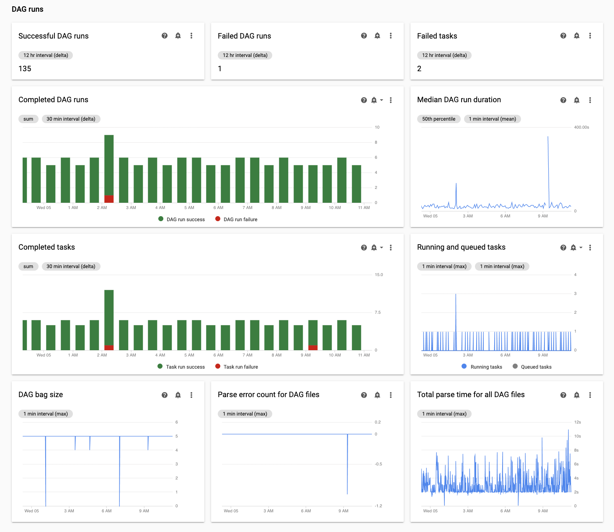
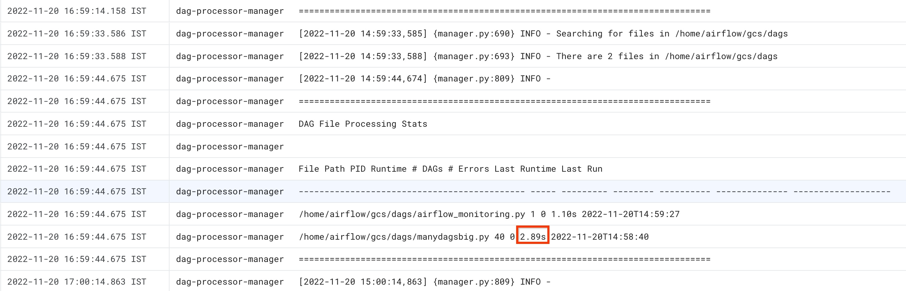

# Troubleshooting Composer
## Troubleshooting DAGs

- Many DAG execution issues are caused by non-optimal environment performance

### Troubleshooting workflow
- You can increase the logging level of Airflow by overriding the following Airflow configuration option.
```
[logging]
logging_level:  DEBUG
```
- You can view the task logs in the Cloud Storage logs folder associated with the Cloud Composer environment
- These logs can be viewed on the logs tab of the Environment details page or in the Cloud Logging.

- To view the streaming logs in Cloud Logging:
   - Go to the Logs Explorer in the Google Cloud console.
   - Go to Logs Explorer
   - Select the logs you want to see.
   - You can filter by properties such as log file and level, predefined label, task name, workflow, and execution date

## Troubleshooting Airflow scheduler issues
- Identify if the issue happens at DAG parse time or while processing tasks at execution time

- Increase parameters related to DAG parsing:
   - Increase dagbag-import-timeout to at least 120 seconds (or more, if required).
   - Increase dag-file-processor-timeout to at least 180 seconds (or more, if required). This value must be higher than dagbag-import-timeout.
```
AIRFLOW__CORE__DAGBAG_IMPORT_TIMEOUT
AIRFLOW__CORE__DAG_FILE_PROCESSOR_TIMEOUT
```


### Inspecting DAG parse times
- In the Monitoring tab, review the Total parse time for all DAG files chart in the DAG runs section and identify possible issues.



### Inspect DAG parse times with the Cloud Composer Logs tab:
- In Monitoring, Go to the Logs tab, and from the All logs navigation tree select the DAG processor manager section.
- Review dag-processor-manager logs and identify possible issues.



### Monitoring running and queued tasks
- In the Monitoring tab, review the Running and queued tasks chart in the DAG runs section and identify possible issues.

## Troubleshooting issues at DAG parse time
### Limited number of threads
```
[scheduler]
parsing_processes = <NUMBER_OF_CORES_IN_MACHINE - 1>
```

## Avoid task scheduling during maintenance windows
- You can define specific maintenance windows for your environment.
   - Go to the Environment configuration tab.
   - Next to the Maintenance windows entry, click Edit.
   - In the Maintenance windows dialog, select the Set custom time for maintenance windows checkbox.


## Make the Airflow scheduler ignore unnecessary files
- Create an .airflowignore file.
- In this file, list files and folders that should be ignored.
- Upload this file to the /dags folder in your environment's bucket.

## Airflow scheduler processes paused DAGs
- Airflow scheduler will continue parsing paused DAGs. If you really want to improve Airflow scheduler performance, use .airflowignore or delete paused DAGs from DAGs folder.

## Usage of 'wait_for_downstream' in your DAGs
- If you set the wait_for_downstream parameter to True in your DAGs, then for a task to succeed, all tasks that are immediately downstream of this task must also succeed. 

- It means that execution of tasks belonging to a certain DAG run might be slowed down by execution of tasks from the previous DAG run

## Symptoms of Airflow Database being under load pressure
- Sometimes in the Airflow scheduler logs you might see the following warning log entry
```
Scheduler heartbeat got an exception: (_mysql_exceptions.OperationalError) (2006, "Lost connection to MySQL server at 'reading initial communication packet', system error: 0")"
```

- Such an error or warning might be a symptom of Airflow Metadata database being overwhelmed with the number of open connections or the number of queries executed in the same time, either by schedulers or other Airflow components like workers, triggerers, and web servers.

### Solutions
- Remove unnecessary data from the Airflow database
- Lower the number of Schedulers. In most cases, either one or two schedulers are enough to parse and schedule Airflow tasks; it's not recommended to configure more than two schedulers, unless there is a justified case.
- Avoid using global variables in Airflow DAGs: Cloud Composer environment variables and Airflow variables.
- Set [scheduler]scheduler-heartbeat-sec to a higher value, for example, to 15 seconds or more.
- Set [scheduler]job-heartbeat-sec to a higher value, for example 30 seconds or more.

```
AIRFLOW__SCHEDULER__SCHEDULER_HEARTBEAT_SEC
AIRFLOW__SCHEDULER__JOB_HEARTBEAT_SEC
```

## Workarounds for issues encountered during backfilling DAGs
- Sometimes, you might want to re-run DAGs that were already executed. You can do it with the Airflow command line tool in the following way:
```
gcloud composer environments run \
  ENVIRONMENT_NAME \
  --location LOCATION \
   dags backfill -- -B \
   -s START_DATE \
   -e END_DATE \
   DAG_NAME 
```

- Note: To re-run only failed tasks for a specific DAG, also use the --rerun-failed-tasks argument.

